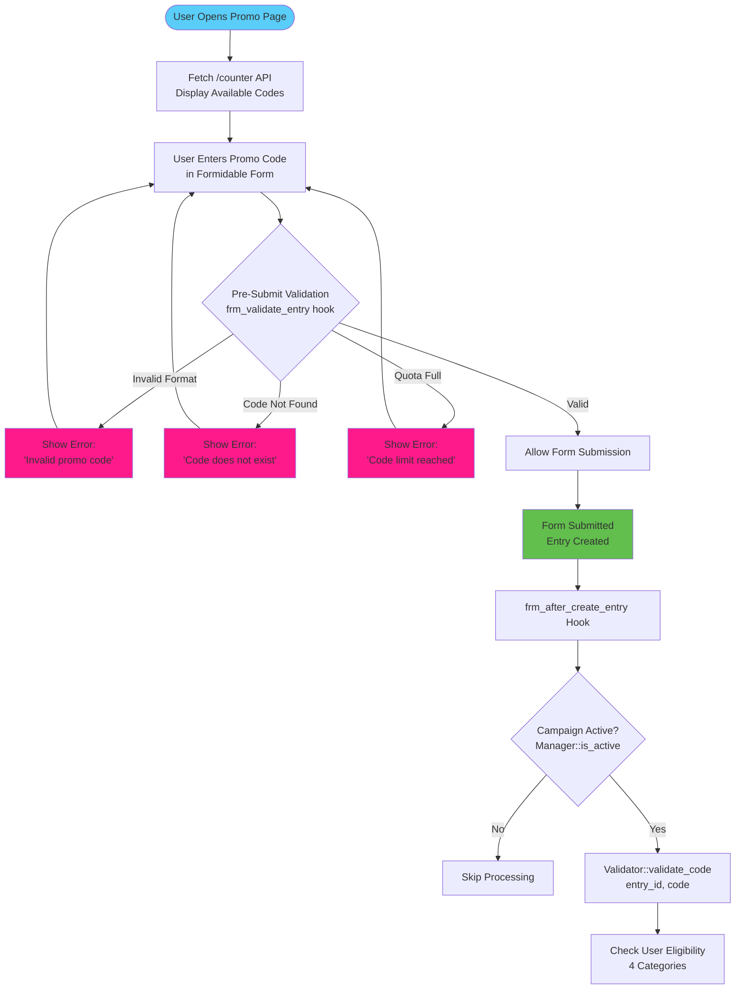
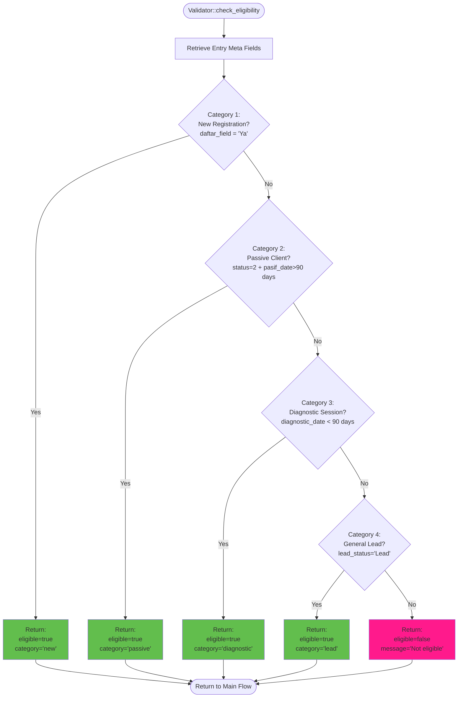
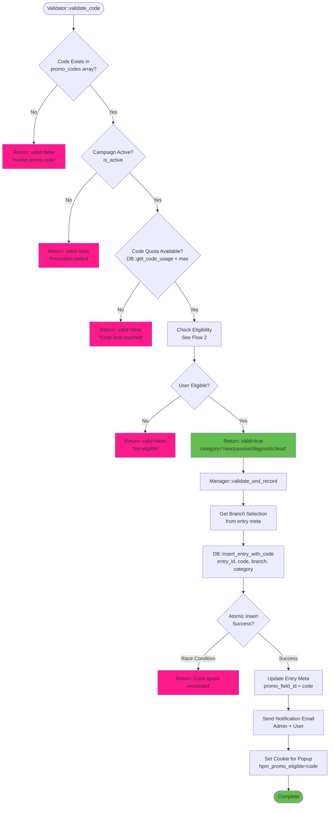
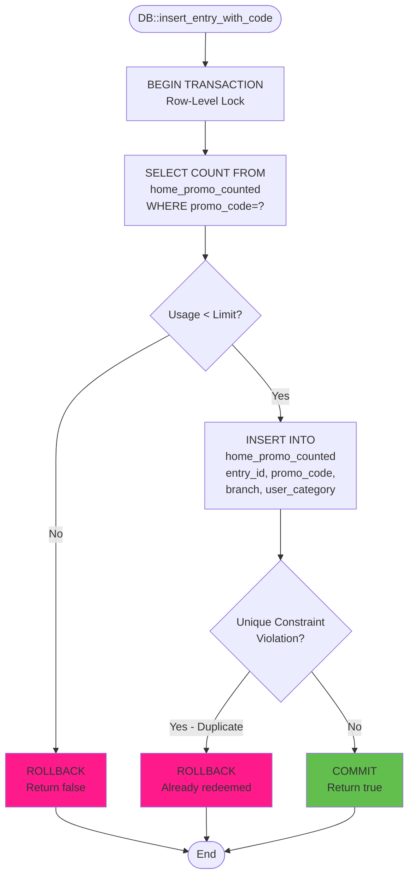
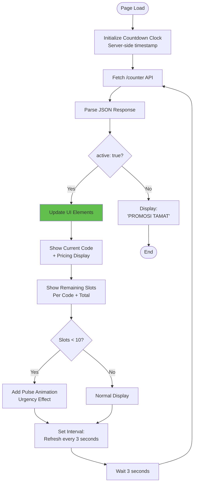
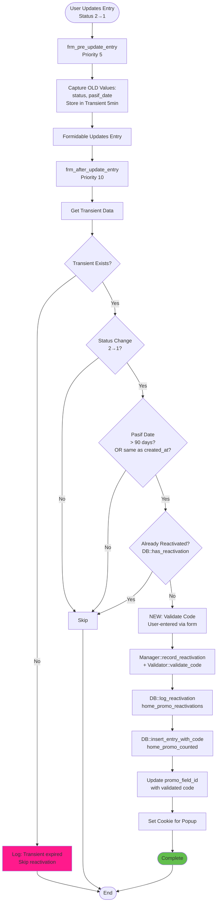
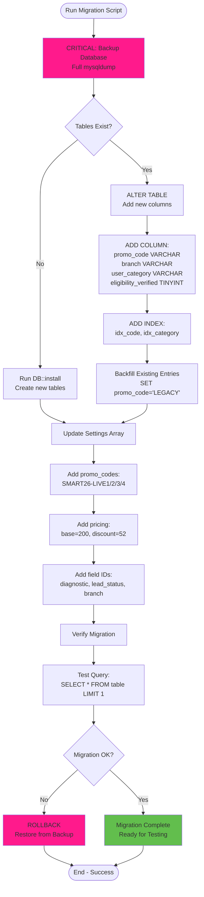
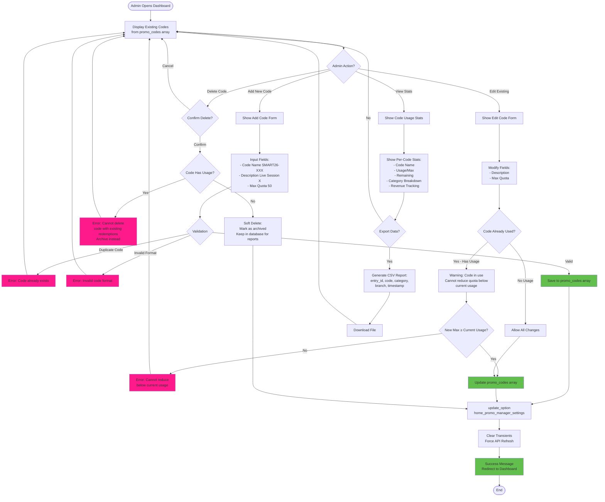

# SMART26 Process Flow Diagrams

## Overview
This document visualizes the complete workflow for the Smart 26 campaign implementation, showing how different components interact from user registration to final confirmation.

---

## Flow 1: User Registration & Code Validation



---

## Flow 2: Eligibility Checking (4 Categories)



---

## Flow 3: Code Validation & Recording



---

## Flow 4: Database Recording (Atomic Transaction)



---

## Flow 5: REST API - Real-Time Counter

```mermaid
flowchart TD
    Start([Frontend Calls<br/>/wp-json/promo/v1/counter]) --> CheckActive{Campaign Active?}
    
    CheckActive -->|No| ReturnInactive[Return JSON:<br/>active: false]
    CheckActive -->|Yes| GetCodes[Get promo_codes config<br/>SMART26-LIVE1/2/3/4]
    
    GetCodes --> Loop[For Each Code]
    Loop --> QueryDB[DB::get_code_usage<br/>code]
    QueryDB --> Calculate[Calculate:<br/>used, max, remaining]
    Calculate --> BuildStats[Build code_stats array]
    
    BuildStats --> MoreCodes{More Codes?}
    MoreCodes -->|Yes| Loop
    MoreCodes -->|No| GetTotal[DB::count_entries<br/>Total used]
    
    GetTotal --> BuildResponse[Build JSON Response]
    BuildResponse --> ReturnJSON[Return JSON:<br/>- active: true<br/>- codes: {...}<br/>- total: {...}<br/>- pricing: {...}<br/>- end_time: ...]
    
    ReturnInactive --> End([End])
    ReturnJSON --> End
    
    style ReturnJSON fill:#62be4d
```

---

## Flow 6: Frontend Real-Time Updates



---

## Flow 7: Admin Dashboard Monitoring

```mermaid
flowchart TD
    Start([Admin Opens Dashboard]) --> RenderSettings[Render Settings UI<br/>Campaign Config]
    
    RenderSettings --> GetStats[DB::get_code_stats<br/>Group by promo_code]
    GetStats --> RenderTable[Render Code Usage Table]
    
    RenderTable --> Loop[For Each Code]
    Loop --> ShowRow[Display Row:<br/>Code | Description | Used/Max | Progress Bar]
    ShowRow --> CalcPercent[Calculate: used/max × 100%]
    CalcPercent --> ColorCode{Percentage?}
    
    ColorCode -->|< 50%| Green[Green Progress Bar]
    ColorCode -->|50-80%| Yellow[Yellow Progress Bar]
    ColorCode -->|> 80%| Red[Red Progress Bar<br/>+ Alert Icon]
    
    Green --> MoreCodes{More Codes?}
    Yellow --> MoreCodes
    Red --> MoreCodes
    
    MoreCodes -->|Yes| Loop
    MoreCodes -->|No| GetCategory[DB::get_category_stats<br/>Group by user_category]
    
    GetCategory --> RenderBreakdown[Render Category Breakdown:<br/>New | Passive | Diagnostic | Lead]
    RenderBreakdown --> CheckMilestone{Milestone Reached?<br/>25/50/75/100 per code}
    
    CheckMilestone -->|Yes| SendAlert[Send Email Alert<br/>Admin Notification]
    CheckMilestone -->|No| Skip[Skip]
    
    SendAlert --> End([End])
    Skip --> End
    
    style RenderTable fill:#62be4d
    style SendAlert fill:#5acdf8
```

---

## Flow 8: Reactivation Logic (Existing Flow - Modified)



---

## Flow 9: Migration Process (v1 → v2)



---

## Flow 10: Admin Code Management (Dynamic Configuration)



### Admin UI Mockup - Code Management Section

```
┌─────────────────────────────────────────────────────────────┐
│ HOME Promo Manager - Code Configuration                    │
├─────────────────────────────────────────────────────────────┤
│                                                             │
│ ┌─ Promo Codes ────────────────────────────────────────┐  │
│ │                                                        │  │
│ │  Code Name         Description    Max   Used  Actions │  │
│ │  ─────────────────────────────────────────────────────│  │
│ │  SMART26-LIVE1  Live Session 1    50    42   [Edit]  │  │
│ │  SMART26-LIVE2  Live Session 2    50    38   [Edit]  │  │
│ │  SMART26-LIVE3  Live Session 3    50     5   [Edit]  │  │
│ │  SMART26-LIVE4  Live Session 4    50     0   [Edit]  │  │
│ │                                                        │  │
│ │  [+ Add New Code]                                     │  │
│ └────────────────────────────────────────────────────────┘  │
│                                                             │
│ ┌─ Add/Edit Code Form ─────────────────────────────────┐  │
│ │                                                        │  │
│ │  Code Name:      [SMART26-LIVE5          ]           │  │
│ │                  (Format: SMART26-XXXXX)              │  │
│ │                                                        │  │
│ │  Description:    [Live Session 5          ]           │  │
│ │                                                        │  │
│ │  Max Quota:      [50    ] slots                       │  │
│ │                  ⚠️  Current usage: 0                  │  │
│ │                  Cannot set below current usage       │  │
│ │                                                        │  │
│ │  Status:         [●] Active  [ ] Archived             │  │
│ │                                                        │  │
│ │  [Save Code]  [Cancel]                                │  │
│ └────────────────────────────────────────────────────────┘  │
│                                                             │
│ ┌─ Bulk Operations ────────────────────────────────────┐  │
│ │                                                        │  │
│ │  [Import Codes from CSV]                              │  │
│ │  [Export All Codes]                                   │  │
│ │  [Clone Existing Code]                                │  │
│ │  [Archive All Unused Codes]                           │  │
│ └────────────────────────────────────────────────────────┘  │
└─────────────────────────────────────────────────────────────┘
```

### Dynamic Code Configuration Features

| Feature | Implementation | Notes |
|---------|----------------|-------|
| **Add Code** | Admin form → `promo_codes` array | No hard limit on number of codes |
| **Edit Code** | Update array entry | Cannot reduce quota below current usage |
| **Delete Code** | Soft delete (archive flag) | Preserve for reporting |
| **Real-time Validation** | AJAX check for duplicates | Prevent conflicts |
| **Quota Management** | Dynamic max adjustment | Auto-warn if reducing quota |
| **Code Format Validation** | Regex: `/^SMART26-[A-Z0-9\-]+$/i` | Enforce naming convention |
| **Import/Export** | CSV bulk operations | Mass code setup |
| **Code Cloning** | Copy existing code settings | Quick setup for similar codes |

### Settings Storage Structure (Dynamic)

```php
// OLD (v1) - Fixed 2-tier
'code_tier1' => 'promo24',
'code_tier2' => 'promo12',
'tier1_max' => 240

// NEW (v2) - Dynamic multi-code
'promo_codes' => [
    'SMART26-LIVE1' => [
        'max' => 50,
        'description' => 'Live Session 1',
        'active' => true,
        'created_at' => '2026-01-05 10:00:00',
        'archived' => false
    ],
    'SMART26-LIVE2' => [...],
    'SMART26-CUSTOM1' => [...],  // Admin can add unlimited codes
    'PROMO-SPECIAL' => [...],     // Different naming allowed
]
```

### API Response with Dynamic Codes

```json
{
  "active": true,
  "codes": {
    "SMART26-LIVE1": {
      "used": 42,
      "max": 50,
      "remaining": 8,
      "description": "Live Session 1",
      "status": "active"
    },
    "SMART26-LIVE2": {
      "used": 38,
      "max": 50,
      "remaining": 12,
      "description": "Live Session 2",
      "status": "active"
    },
    "SMART26-CUSTOM1": {
      "used": 0,
      "max": 25,
      "remaining": 25,
      "description": "VIP Exclusive",
      "status": "active"
    }
  },
  "total": {
    "used": 80,
    "max": 200,
    "remaining": 120
  }
}
```

---

## Key Decision Points & Validation Gates

### 1. **Pre-Submit Validation** (Frontend + Backend)
- ✅ Code format check (SMART26-LIVE[1-4])
- ✅ Code existence check (in promo_codes array)
- ✅ Quota availability (real-time check)
- ❌ Block submission if any fail

### 2. **Eligibility Verification** (4 Categories - Sequential Check)
1. **New Registration**: `daftar_field = 'Ya'` → **PASS** immediately
2. **Passive Client**: `status=2` + `pasif_date > 90 days` → **PASS**
3. **Diagnostic Session**: `diagnostic_date < 90 days` → **PASS**
4. **General Lead**: `lead_status = 'Lead'` → **PASS**
5. **None Match**: → **FAIL** - User not eligible

### 3. **Atomic Recording** (Race Condition Prevention)
```sql
BEGIN TRANSACTION;
  SELECT COUNT(*) FROM table WHERE promo_code=? FOR UPDATE;
  IF count < limit THEN
    INSERT INTO table VALUES (...);
  COMMIT;
ELSE
  ROLLBACK;
```

### 4. **Critical Timestamps** (All in Asia/Kuala_Lumpur TZ)
- Campaign Start: `2026-01-12 12:00:00`
- Campaign End: `2026-01-14 11:59:00`
- Duration: 48 hours exactly

---

## Error Handling Patterns

| Error Scenario | Detection Point | Response | User Message |
|----------------|-----------------|----------|--------------|
| Invalid code format | `frm_validate_entry` | Block submit | "Invalid promo code" |
| Code quota full | `Validator::validate_code` | Reject | "Code limit reached" |
| Not eligible | `check_eligibility` | Reject | "Not eligible for promo" |
| Duplicate redemption | DB unique constraint | Reject | "Already redeemed" |
| Campaign ended | `Manager::is_active` | Skip processing | "Promotion ended" |
| Transient expired | Reactivation flow | Log + skip | (Silent - debug log) |

---

## Performance Considerations

### Database Queries per Registration:
1. `frm_validate_entry`: 1 SELECT (code usage check)
2. `check_eligibility`: 4-6 SELECTs (entry meta fields)
3. `insert_entry_with_code`: 1 SELECT + 1 INSERT (atomic)
4. `update_entry_meta`: 1 INSERT/UPDATE
5. **Total**: ~8-10 queries per registration

### Optimization:
- ✅ Indexes on `promo_code`, `user_category`
- ✅ Transient caching for reactivation (5 min)
- ✅ Frontend API polling: 3 seconds (not real-time WebSocket)

---

## Testing Scenarios

### Scenario 1: Normal Registration
1. User enters valid code `SMART26-LIVE1`
2. User is new registration (`daftar='Ya'`)
3. Code has 45/50 slots used
4. ✅ **Expected**: Code applied, slot count → 46/50

### Scenario 2: Code Quota Exceeded
1. User enters `SMART26-LIVE1`
2. Code already at 50/50
3. ❌ **Expected**: Form validation error "Code limit reached"

### Scenario 3: Ineligible User
1. User enters valid code
2. User is NOT new, NOT passive, NO diagnostic, NOT lead
3. ❌ **Expected**: Validation error "Not eligible"

### Scenario 4: Race Condition
1. Two users submit simultaneously with same code at 49/50
2. Both pass pre-validation
3. Database atomic insert ensures only ONE succeeds
4. ✅ **Expected**: One success, one failure

### Scenario 5: Campaign Ended
1. User tries to register after `2026-01-14 11:59:00`
2. `is_active()` returns false
3. ❌ **Expected**: Form disabled, API returns `active: false`

---

## Notes for Implementation

1. **Validator.php exists but wrong spec** - needs refactoring to match this flow
2. **Database migration MUST run before Jan 12** - allow time for testing
3. **Transient expiry** - consider increasing to 10 minutes for safety
4. **Cookie-based popup** - only works if user stays on same browser
5. **Email notifications** - configure SMTP properly for production

---

**Document Version**: 1.0  
**Created**: 2026-01-05  
**Purpose**: Pre-implementation flow validation
